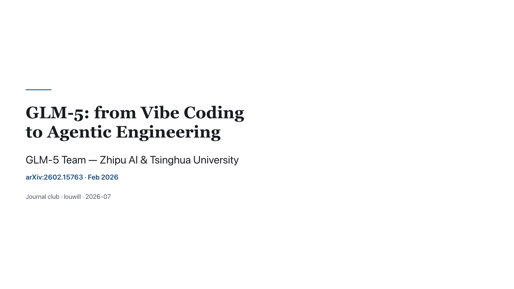
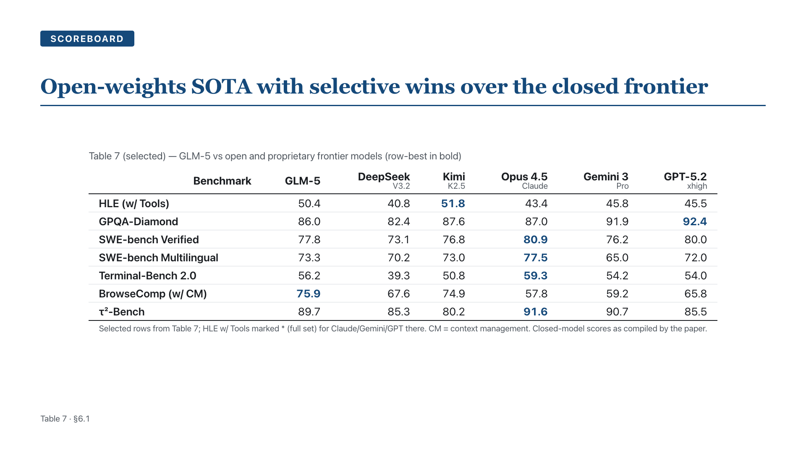
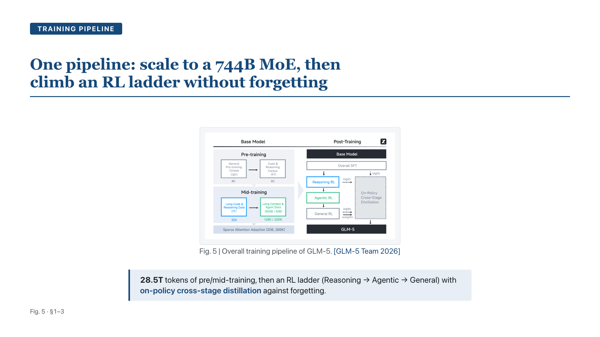

# scholar-slides

Turn a research paper (or an arXiv/DOI link, or a topic) into a **fidelity-first** academic slide
deck — one where every equation, table, number, figure, and citation stays **true vector/text and
traceable to the source**, never rasterized by an image model and never fabricated.

It is a Claude *skill*: the entry point and pipeline live in [`SKILL.md`](SKILL.md). The design
rationale, the survey it grew from, and the build plan are development-history docs kept in the
project repo under [`docs/scholar-slides-design/`](../docs/scholar-slides-design/) — outside the
installable skill, which is self-contained.

## Why it exists

Generic AI-PPT tools optimize the aesthetic ceiling. Academia inverts the priorities: **source
fidelity > polish, evidence > persuasion, editability > flash.** A journal-club deck that renders a
BLEU score as a fuzzy image, silently rounds a p-value, or drops the citation is worse than useless —
it is *wrong*. scholar-slides is built around a non-negotiable integrity gate so that can't happen,
and *then* makes it beautiful.

The moat is the crossing of two axes generic tools can't both hit — see
[`benchmarks/eval/scorecard.md`](benchmarks/eval/scorecard.md):

- **Academic fidelity** (where generic tools structurally lose): numbers grounded in the source,
  KaTeX vector equations, real OOXML tables, real cited figure crops, resolved references,
  `[MISSING]`/`[UNVERIFIED]` flags instead of silent fills — verified end-to-end into the editable PPTX.
- **Design** (where we aim to be competitive): a Nature/Science figure-editor register — one accent,
  a modular type scale on an 8pt grid, figures matted and legible, a scoreable aesthetics rubric.

## Pipeline

```
INPUT → 1.INGEST/DIGEST → [CKPT-1] → 2.DECK-TYPE → 3.OUTLINE → [CKPT-2]
      → 4.PER-SLIDE SPEC → 5.RENDER → 6.SELF-REVIEW (integrity + aesthetics) → [CKPT-3] → 7.EXPORT
```

Deterministic rendering (equations always KaTeX, tables always real, figures always the real crop);
judgment lives in the spec. Three human checkpoints; a deck is "done" only after the CKPT-3 truth
sign-off. Outputs: an interactive reveal.js deck, a vector PDF, an **editable PPTX**, speaker notes
with a bilingual timing estimate, and data-bound charts. Bilingual EN / 中文.

## Worked examples (`out/`)

<p align="center">
  
  <br>
  
  
</p>

| deck (`out/`) | register | what it shows |
|---|---|---|
| `attention` | journal-club | "Attention Is All You Need" — a KaTeX equation + the real BLEU table |
| `deepseek_v32` | journal-club | DeepSeek-V3.2 — figure slides, a 6-model results table, an inline-emphasis critique |
| `deepseek_conf` | conference | the same paper as a big-room cut — full-bleed dark cover, section rhythm, **0% bullets** |
| `glm5` · `glm5_zh` | journal-club | GLM-5 (EN + 中文) — 15-slide decks, ablation + scoreboard tables, a redrawn hero figure |

Each deck ships `deck/deck.html` (present), `deck/deck.pdf` (project), `deck/deck.pptx` (edit) and
`notes.md`. `deck.json` is the durable spec (tracked in git); rebuild any deck with the commands below.

## Themes

`meta.theme` selects a visual flavor over a shared `base-theme.css`: `journal-club` (default,
reading-first) or `conference` (big-room, punchier). A theme is a thin token-override file — the
payoff of the design-token architecture.

## Install

```bash
./install.sh          # .venv + npm + the Chromium binary; verifies with the test suites
```

Prereqs: **Python 3.11+, Node 18+.** Latin text and math ship with the deck; for **Chinese decks on
Linux** install a CJK font once — `sudo apt-get install fonts-noto-cjk` (macOS/Windows already have
PingFang/Songti/YaHei). `install.sh` lists the manual steps if you'd rather run them yourself.

## Run it

```bash
# ingest a paper → digest bundle (Python venv)
./.venv/bin/python scripts/prepare_source.py <pdf | arXiv-id | arXiv-URL> --out out/<name>
# after authoring out/<name>/deck.json:
node scripts/build_deck.mjs   out/<name>/deck.json out/<name>/deck      # reveal.js + print HTML
node scripts/render_deck.mjs  out/<name>/deck/deck.html pdf out/<name>/deck/deck.pdf
node scripts/export_pptx.mjs  out/<name>/deck.json out/<name>/deck/deck.pptx
node scripts/qa_report.mjs    out/<name>/deck                            # integrity + aesthetics gate
```

## Quality gates & tests

```bash
node --test tests/*.mjs                          # Node unit tests
./.venv/bin/python -m pytest -p no:warnings      # Python unit + integration tests
node scripts/run_benchmark.mjs                   # regress the whole corpus (QA + PPTX parity + layout-mix)
python scripts/verify_pptx_parity.py <deck.json> <deck.pptx>   # PPTX preserves the spec natively
```

## Known limitations (the honest edge)

- **Figure localization is layout-dependent.** On single-column / arXiv / Nature-style papers, bbox
  detection runs ~95–100%; on dense IEEE/TPAMI two-column pages with many small sub-figures it drops
  to ~75% and the region-grow can over-capture. Crucially, low-confidence assets are **flagged for
  you to confirm at CKPT-1** — never silently wrong — and a mis-crop is a one-line manual fix.
  Stress-tested over 9 cross-layout papers: **0 crashes, 98% of figures localized, ~92% usable as-is.**
- **Tables are rebuilt as data, not cropped** — by design (they become real OOXML / `<table>`), so a
  table without a figure bbox is expected, not a failure.
- **Scanned PDFs need OCR first** (not built). **Zotero citations** are an agent-runtime MCP step;
  headless / no-network falls back to Crossref/arXiv, and anything unresolved becomes `[UNVERIFIED]`.

## Status

Pipeline stages 1–5 complete; the aesthetics program is through **M5** (design-system tokens →
figure pipeline → theme architecture + conference theme → content-adaptive layout metric →
PPTX-parity regression + benchmark harness → two-axis scorecard). Hardened for release: the four
first-day bugs are fixed (browser presenter view, graceful no-Chromium PPTX export, space-safe
`file://` paths, deck.json spec validation), CJK renders cross-platform, and a clean-machine install
is verified. Next: external blind eval, growing the benchmark toward 15+ papers. Deferred: Beamer
export, OCR for scanned PDFs. See [`docs/scholar-slides-design/IMPLEMENTATION_PLAN.md`](../docs/scholar-slides-design/IMPLEMENTATION_PLAN.md).
